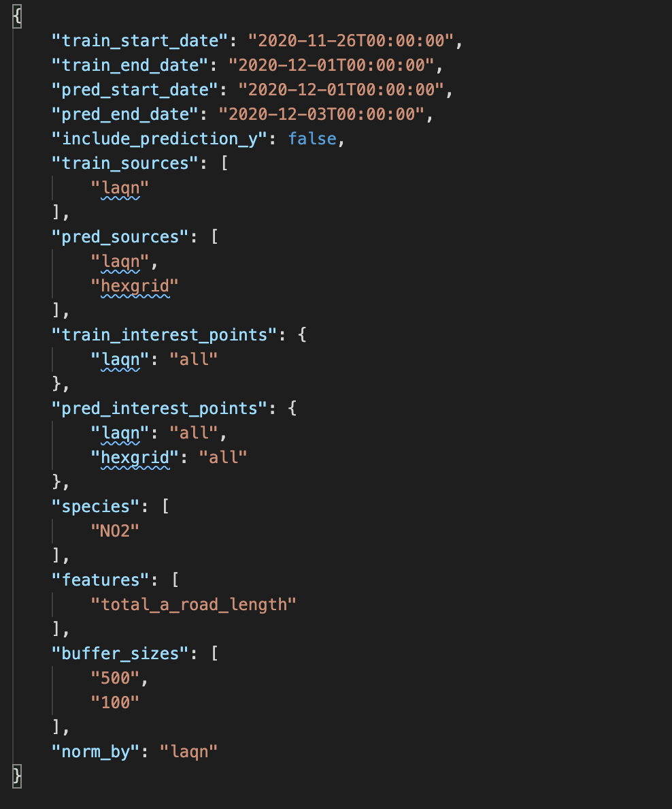
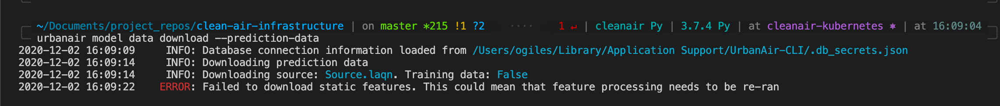
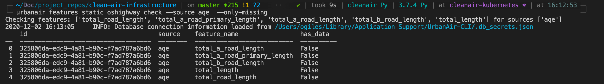

#  Fitting CleanAir models using the CLI

Before starting delete the contents of the urbanair cache to remove all old data

```bash
urbanair config remove
```

## Downloading data

Make sure you have logged into the azure CLI,

```bash
az login
```

and then log into the CLI (gets a token for the database and caches it)

```bash
urbanair init production
```

If something doesn't work, often your token has expired. Rerun the above command and try again.

Make sure you dont have an `PGPASSWORD` environment variable set. This will override the token in the cache.


### Generate a configuration file

CleanAir uses `json` config files to configure what sensor inputs, features and pollutant species to train on. You can generate a config file with:

```bash
urbanair model data generate-config \
    --trainupto yesterday \
    --traindays 5 \
    --preddays 2 \
    --train-source laqn \
    --pred-source laqn \
    --pred-source hexgrid \
    --species NO2 \
    --features total_a_road_length \
    --feature-buffer 500 \
    --feature-buffer 100 \
    --overwrite
```

This creates a config for a model to train on 5 days of data upto yesterday (exclusive of yesterday). It will then forecast pollution for the next 2 days (yesterday and today). `--train-source laqn` means train using data from laqn sensors. `--pred-source laqn` and `--pred-source hexgrid` mean to predict at the spatial locations of the laqn sensors and hexgrid (a grid of hexagons over london).

The config is downloaded to a cache. To view it run :

```bash
urbanair model data echo-config > model_config.json
```

The file will look something like this:



We can see the training a prediction dates. Of interest here are `train_interest_points` and `pred_interest_points`. These can either be `all` in which case all interest points are used, or a list of `UUID` specifying which interest points to use.

### Generate a full configuration file

Now we can generate a `full` config file. This will run some simple checks against the database (e.g. do the things you've asked for exist) and will expand fields like `train_interest_points` with `UUID`'s if `all` was specified.

```bash
urbanair model data generate-full-config
```

Update your config file and take a look

```bash
urbanair model data echo-config --full > model_config.json
```

### Download data from the database to the cache

To download the data we can call,
```bash
urbanair model data download --training-data --prediction-data --output-csv
```

specifying whether we want to download training data and or prediction data. Often you want both, but if  predicting on the  hexgrid this can be a lot of data and make take a long time. The `--output-csv` flag will also store the data in csv, which can be very useful for debugging. You can also load these files into [kepler.gl](https://kepler.gl/) to visualise it.

## Copy the cache to a directory

You can copy the data from the cache to a directory with:

```bash
urbanair model data save-cache model_data
```

where `model_data` is the name of the directory to copy the cache to. 

:skull:  Note that this will create the directory for you,

### :bangbang: Download errors

Occasionally you might see an error like the one below, which normally happens because a new `LAQN` or `AQE` sensor has been installed (or it's name has been changed, moved or something else). These sensors will be registered in the CleanAir database, but features have not been processed at their locations.



We can confirm this by checking if any features are unprocessed at the `laqn` or `aqe` sites,

```bash
urbanair features static ukmap check --source laqn --source aqe --source hexgrid --source satellite --only-missing
```

```bash
urbanair features static streetcanyon check --source laqn --source aqe --source hexgrid --source satellite --only-missing
```

```bash
urbanair features static oshighway check --source laqn --source aqe --source hexgrid --source satellite --only-missing
```

On this occasion when we ran the last command we see an interest point has not been processed for aqe...



We can fix this by rerunning the feature processing, which will only  process the missing features by default.

``` bash
urbanair features static oshighway fill  --source laqn --source aqe --source hexgrid --source satellite
```

``` bash
urbanair features static ukmap fill  --source laqn --source aqe --source hexgrid --source satellite
```

``` bash
urbanair features static streetcanyon fill  --source laqn --source aqe --source hexgrid --source satellite
```

Now try to download the data again.
