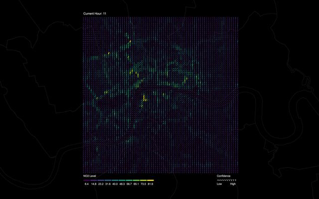
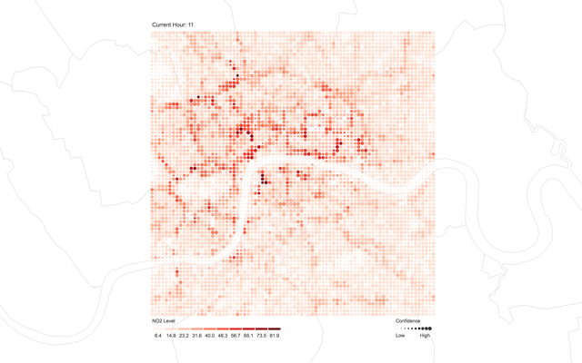

# Visualisation for the London Air Quality Project

The visualisation component of this project is a collaboration between the London air quality project at Turing (Theo, Ollie, Patrick, Oscar, James R, James W), the [visual diagnostics for MCMC project at Turing](https://www.turing.ac.uk/research/research-projects/visual-diagnostics-markov-chain-monte-carlo-mcmc) (Greg and James T) and the GLA (Paul, Libby, Mike).

***

## Minimum requirements (Phase 1)

Our aim is for phase 1 to be complete by January.

1. Show a map of Greater London (all boroughs) with air quality predictions overlayed.
    - **Style**: the style of the grid will depend on the visualisation we decide upon (see below).
    - **Resolution**: the resolution of the grid will depend on the model.
    - **Boundary** :Let the user specify spatial/temporal boundaries before loading the map. This will reduce the size of the data transferred. For spatial queries, 
1. Display air quality predictions over 48 hours.
    - This could be done using a slider?
1. Visualise predictions for 3 different types of pollutants (NO2, PM10, PM2.5).
    - We will show each pollutant seperately on the map - not together.
1. Show the variance of the predictions for a single pollutant at a time.

***

## Future extensions (Phase 2)

1. Zooming in 

***

## Use cases

### General public

#### Walkers, runners & cyclists

A commuter is planning their route to work to minimise air pollution exposure.
Lets say about 5km to get to work.
The first thing the commuter will do when planning their route is to avoid larger

### GLA & public bodies

### Researchers & academics

#### ML researchers

Looking at the uncertainty in more details.
Plug and play different models and seeing how they compare.

#### Air quality researchers

## Output of the API

### Datafile type

### Data size & compression

### Spatial & temporal bounds

***

## Style: visualisation ideas

As it stands, there are three ideas for how to visualise a single pollutant over a map of London.
Rather than trying to show multiple pollutants on the same map, it will be much simpler to have a toggle or tick box on the side of the application to show different pollutants.

### Hex grid

There are multiple resolutions for the hex grid.
One of the advantages of the hex grid is that it fits nicely with existing GLA standards.
One dis-advantage is the hex grid is not so familiar with people external to the GLA (e.g. the general public, external developers), although whether this is an issue is up for debate.
Further it is not immediately clear how to visualise uncertainty using the hex grid.

### Rotating lines

### Circles

***

## Previous systems

### London air (King's college)

### GLA hex system

The GLA have a [hex grid](https://maps.london.gov.uk/green-infrastructure/) map of London.
Each hex has a variable (e.g. poverty, loneliness, etc.) associated with it.

### Breathe London

[Breathe London](https://www.breathelondon.org) displays a dot for each sensor.
By clicking on a dot, you can see the time series for a single pollutant over the last 24 hours.
You can click another buttom called `More data` which displays a time series of the last year of air quality data for a given pollutant at that sensor.

**The ability to request more detail** is a feature we should use.

***

## Extentions / future work

What about inversing the size of the circles representing variances, i.e. highlighting the areas of the model where we are not so certain about the predictions?

***

## Questions

**What is the realistic upper bound we can expect on air pollution? (e.g. 100 \mu g m^{-3})**

> Nitrogen dioxide in London is bounded by ...