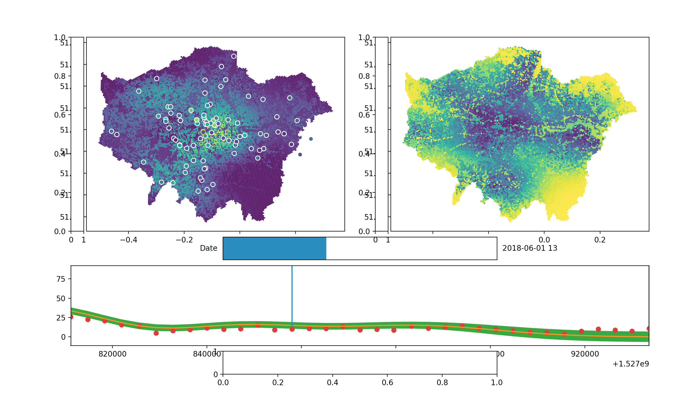

# Visualisation for the London Air Quality Project

The visualisation component of this project is a collaboration between the London air quality project at Turing (Theo, Ollie, Patrick, Oscar, James R, James W), the [visual diagnostics for MCMC project at Turing](https://www.turing.ac.uk/research/research-projects/visual-diagnostics-markov-chain-monte-carlo-mcmc) (Greg and James T) and the GLA (Paul, Libby, Mike).

***

## Minimum requirements (Phase 1)

Our aim is for phase 1 to be complete by January.

1. **Map**: show a map of Greater London (all boroughs) with air quality predictions overlayed.
    - **Style**: the style of the grid will depend on the visualisation we decide upon (see below).
    - **Resolution**: the resolution of the grid will depend on the model.
    - **Boundary**: let the user specify spatial/temporal boundaries before loading the map. This will reduce the size of the data transferred. For spatial queries, 
1. **Temporal**: display air quality predictions over 48 hours.
    - This could be done using a slider?
1. **Multi-variate**: visualise predictions for 3 different types of pollutants (NO2, PM10, PM2.5).
    - We will show each pollutant seperately on the map - not together.
1. **Variance**: show the variance of the predictions for a single pollutant at a time.
1. **Key**: a colour/symbol key to simply explain what the a given colour and symbol mean.
    - **Units**: the key should show both the value of the pollutant (e.g. 60 micro grams per cubin meter) and whether this is low, medium or high air pollution.
1. **Pop ups**: small pop ups or boxes with information about how to interpret the predictions and visualisations should be added to aid the user's understanding and help them navigate the web app.

***

## Future extensions (Phase 2)

After the January deadline, we would like to add more features for examining the model predictions in detail.

1. **Time series**: Show the training and prediction time series of a given point.
    - **Grid square**: by clicking a grid square, the time series will plot mean and variance of recent predictions and the next 48 hours of predictions for that grid square.
    - **Sensor**: by clicking on a sensor, the time series will plot the mean and variance of recent predictions (e.g. for the last week) against the sensor data.
1. **Zooming**: show two different grid resolutions to allow greater spatial detail.
    - We show the whole of London in 100m grid resolution. We show detail in 20m resolution.

***

## Use cases

### General public

#### What's the air quality like in my area?

A concerned citizen wants to know what the air quality is like for the next 48 hours in their area.
This type of query resembles a weather forecast.

#### Walkers, runners & cyclists

A cyclist is planning their route to work this morning and wants to minimise air pollution exposure.
Lets say the fastest route is 10km.
Upon first looking at the web app, the cyclist will want to see at a high level where the bad areas of air quality are.
This will narrow down the available routes.
Once the cyclist has a general trajectory in mind, they will want to zoom in on the map to see in detail which roads are worse than others.
If we clearly explain to the cyclist what the variance of a predictions means, they may also choose a route that is certain to have low air pollution exposure.

### GLA & public bodies

### Researchers & academics

#### ML researchers

Looking at the uncertainty in more details.
Plug and play different models and seeing how they compare.

#### Air quality researchers

***

## Output of the API

### Datafile type

We expect csv and json to be the two most popular file format requests.

### Data size & compression

The size of the response will depend on the resolution of the grid (see below for boundaries).

### Spatial bounds

If a user wants to look at a specific spatial area of London, then the user will send the spatial bounds of this area to the API.
The API should respond with the air quality predictions within these spatial bounds.

If the user wants to scroll around the surrounding area, then the API may send back the predictions for the specified area plus the surrounding area to ensure the web app runs smoothly.

### Temporal bounds

Perhaps a user only wants to know the air quality between 6pm and 10pm tomorrow evening?

***

## Style: visualisation ideas

As it stands, there are three ideas for how to visualise a single pollutant over a map of London.
Rather than trying to show multiple pollutants on the same map, it will be much simpler to have a toggle or tick box on the side of the application to show different pollutants.

### Hex grid

There are multiple resolutions for the hex grid.
One of the advantages of the hex grid is that it fits nicely with existing GLA standards.
One dis-advantage is the hex grid is not so familiar with people external to the GLA (e.g. the general public, external developers), although whether this is an issue is up for debate.
Further it is not immediately clear how to visualise uncertainty using the hex grid.

Above is a screenshot from a python visualisation.
The top left shows the pollution on the hex grid and the sensors.
Yellow means high air pollution and blue means low pollution.
Clicking on a sensor shows the time series for that sensor.

The top right shows the variance of the prediction.
This highlights the weakness dicussed above about visualising both variance and air quality using the hex grid: it seems we must show them side by side.
Equally this weakness could also be a strength: it clearly shows the variance which is useful for e.g. machine learning researchers who want to see the weaknesses of the model.

### Rotating lines

The colour of the line indicates the mean value for NO2 at that point.
Yellow is high air pollution, blue is low air pollution.
The rotation of the line indicates the variance.
Lines which are vertical show predictions with low variance (high certainty).
Lines which are more horizontal show predicitons with higher variance (low certainty).

### Circles

The colour of the line indicates the mean value for NO2 at that point.
Dark red indicates air pollution is high.
Light orange indicates air pollution is low.
The bigger the circle the lower the variance (and the higher the certainty).
This means the eye is naturally drawn to areas of high air pollution with high certainty.

***

## Previous systems

### London air (King's college)

[London air](https://www.londonair.org.uk/) is mostly focuses on reporting the air quality measurements from the London Air Quality Network (LAQN) run by King's College.
They have some modelling to interpolate the sensor readings, but it is not clear how this is done.
They use a simple square grid with a high resolution and no variance to show their predictions.
They do not forecast air quality.

London air uses the Air Quality Index (AQI) with an associated colour scheme.
AQI makes it easier for the general public to understand predictions (as opposed to some arbitrary NO2 value).

### GLA hex system

The GLA have a [hex grid](https://maps.london.gov.uk/green-infrastructure/) map of London.
Each hex has a variable (e.g. poverty, loneliness, etc.) associated with it.

### Breathe London

[Breathe London](https://www.breathelondon.org) displays a dot for each sensor.
By clicking on a dot, you can see the time series for a single pollutant over the last 24 hours.
You can click another buttom called `More data` which displays a time series of the last year of air quality data for a given pollutant at that sensor.
This is a nice feature and something we should think carefully about.

### Weather forecast

Predicting air quality is similar to predicting the weather, except at a much higher spatial resolution.
Perhaps applications such as the [MET office](https://www.metoffice.gov.uk) or [BBC weather](https://www.bbc.co.uk/weather) could offer some insight?

***

## Possible mis-conceptions or mis-understandings

### Variance

If we are highlighting predictions from the model that we are more certain of (i.e. less variance), does that mean we are hiding the weaknesses of our model?

### Continuous

By displaying a grid, we are implying our model predicts over discrete space, even though we can predict over continuous space.

***

## Extentions / future work

What about inversing the size of the circles representing variances, i.e. highlighting the areas of the model where we are not so certain about the predictions?

***

## Questions

**What is the realistic upper bound we can expect on air pollution? (e.g. 100 \mu g m^{-3})**

> Nitrogen dioxide in London is bounded by ...